# Visualizing the Evaluation of ML Models with Yellowbrick and alternate implementations  
>[Yellowbrick](http://www.scikit-yb.org/en/latest/index.html) extends the Scikit-Learn API to make model selection and hyperparameter tuning easier.
---

**Note**: one alternate visualization uses PyViz.Panel. If not installed, un-comment and run this command:
```
#conda install -c pyviz panel
```
---
## The code producing the following visuals is in the module `model_evaluation_reports.py`
```python
import model_evaluation_reports as rpts
```

---
# Yellowbrick binary classification example:
http://www.scikit-yb.org/en/latest/tutorial.html

---
## Model evaluation report using Yellowbrick `ClassificationReport()`:
Yellowbrick's visual report returns a matrix of P, R, and F1 scores for **each** model.  
It is indeed very neat, but in my opinion, not very practical since the goal of the visualization is to enable picking "the best" model...

### With lots of models &rarr; lots of scolling!
```python
# Mushroom dataset & models list:
X, y, labels = rpts.get_mushroom_data()
models = rpts.get_models()

rpts.run_yellowbrick_model_evaluation_report(X, y, models)
```

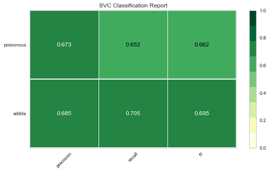

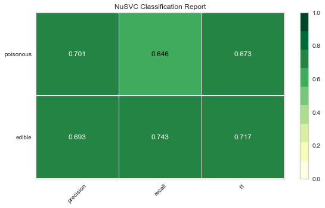

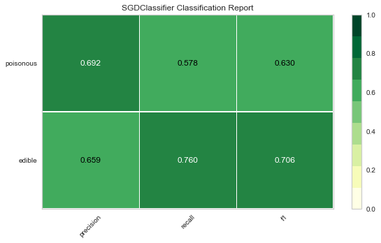

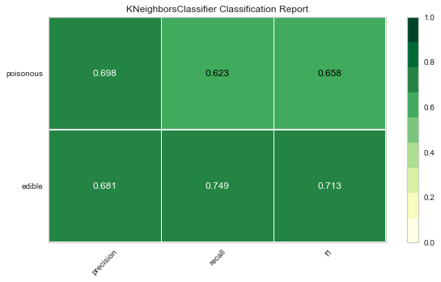

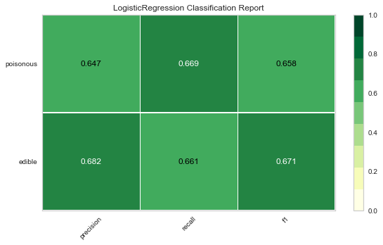

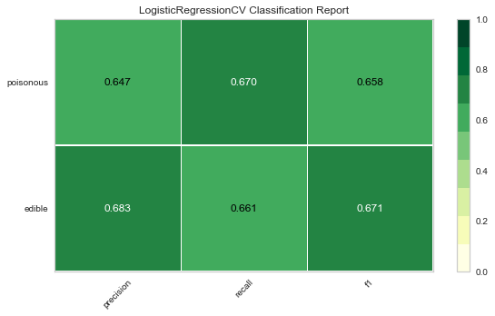

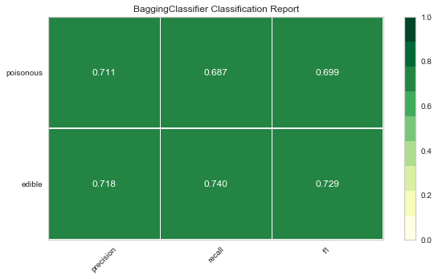


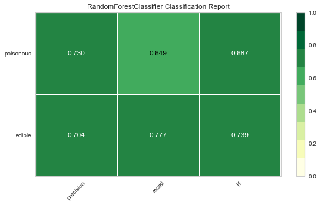


---
# Alternate visualizations

**Note**: The table view uses [PyViz.Panel](https://panel.pyviz.org/)

---
## Gather the evaluation scores into a DataFrame:
```python
# Mushroom dataset & models list:
X, y, labels = rpts.get_mushroom_data()
models = rpts.get_models()

dfm_mushrooms = rpts.get_scores_df(models, X, y, labels)
```

---
## Table output 
### &rarr; using `run_alternate_model_evaluation_report_tbl()`, retaining Support values:
```python
rpts.run_alternate_model_evaluation_report_tbl(dfm_mushrooms) # green: max; pink: min
```
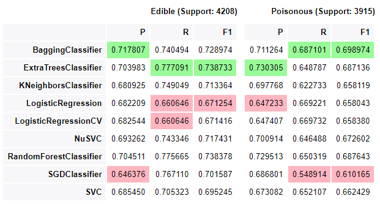


## Bar plot output 
### &rarr; using `run_alternate_model_evaluation_report_bar()`:


```python
rpts.run_alternate_model_evaluation_report_bar(dfm_mushrooms)
```

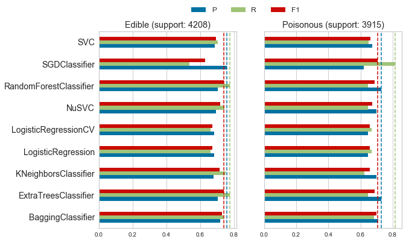


### same with x-limit set to 1:


```python
rpts.run_alternate_model_evaluation_report_bar(dfm_mushrooms, xlim_to_1=True)
```


## Example with a multi-class classification


```python
# Iris dataset & same models:
X, y, labels = rpts.get_iris_data()
models = rpts.get_models()
labels

dfm_iris = rpts.get_scores_df(models, X, y, labels, encode=False)
```
    array(['setosa', 'versicolor', 'virginica'], dtype='<U10')

```python
rpts.run_alternate_model_evaluation_report_bar(dfm_iris)
```
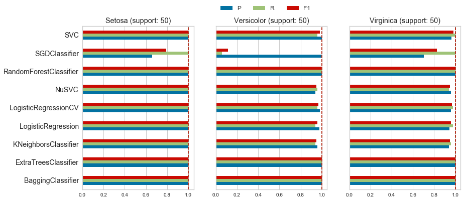

---
# Using radar plots: one plot for each class.

*I've attempted reproducing the radar plots in a single row (whenever possible), but that implementation needs more work as the plots end up being squished too close together.*


```python
def scores_radar_plot_example(dfm_iris, cat='setosa'):
    supp = dfm_iris.loc[(dfm_iris.index.get_level_values(0)[0],
                         dfm_iris.index.get_level_values(1) == cat),
                        'Support'].values[0]
    
    df_set = dfm_iris.loc[dfm_iris.index.get_level_values(1) == cat,
                          dfm_iris.columns[:-1]].reset_index(level=1, drop=True)
    df_set.index.name = '{} (support: {})'.format(cat.title(), supp)
    
    ax = rpts.scores_radar_plot(df_set)
    
    '''
    # a bit too crowded with additional text:
    fig = plt.gcf()
    s = 'Radar plot of model selection scores for class {}'.format(cat.title())
    fig.text(0.5, -0.05, s,
             ha='center',
             fontsize='large')
    '''
    plt.show();
```

I'm glad I went through adapting DeepMind/bsuite radar charts, but I am I not quite satisfied with the outcome, at least with the Iris dataset: they only make it easy to id the least performant model, here SGDClassifier.  
Additionally, until I find a way to line up the plots more compactly, they also suffer from the same 'scrolling objection' I initially made...with only 3 classes!


```python
for lbl in labels:
    scores_radar_plot_example(dfm_iris, cat=lbl)
```

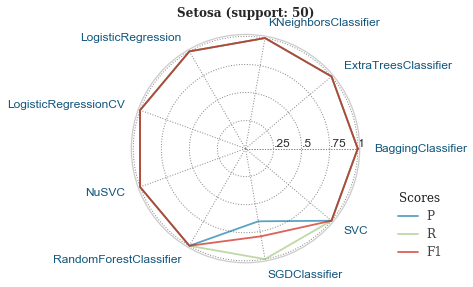

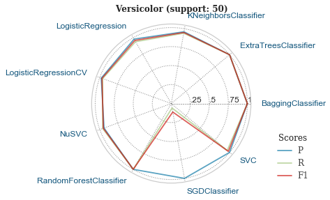

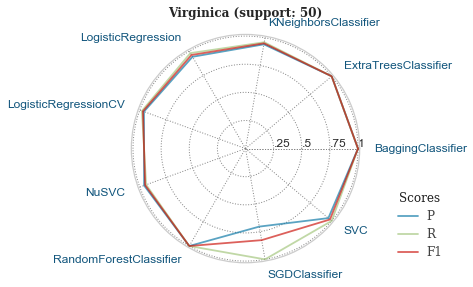
