# Visualizing the Evaluation of ML Models with Yellowbrick and alternate implementations  
>[Yellowbrick](http://www.scikit-yb.org/en/latest/index.html) extends the Scikit-Learn API to make model selection and hyperparameter tuning easier.
---

## The code producing the following visuals is in the module `model_evaluation_reports.py`
```python
import model_evaluation_reports as rpts
```

---
# Yellowbrick binary classification example:
http://www.scikit-yb.org/en/latest/tutorial.html

---
## Model evaluation report using Yellowbrick `ClassificationReport()`:
Yellowbrick's visual report returns a matrix of P, R, and F1 scores for **each** model.  
It is indeed very neat, but in my opinion, not very practical since the goal of the visualization is to enable picking "the best" model...

### With lots of models &rarr; lots of scolling!

### Data and models:
```python
# Mushroom dataset & models list:
X, y, labels = rpts.get_mushroom_data()
models = rpts.get_models()
```

```python
rpts.yellowbrick_model_evaluation_report(X, y, models)
```

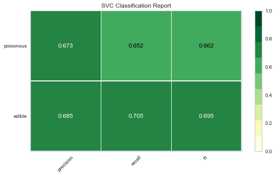

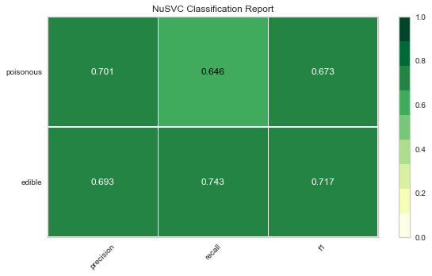

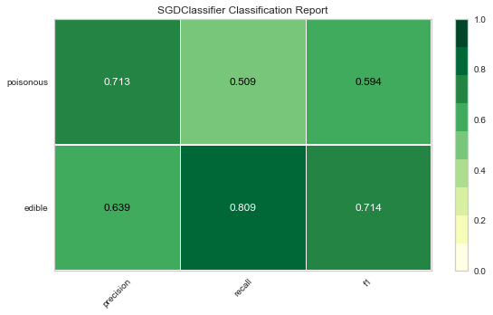

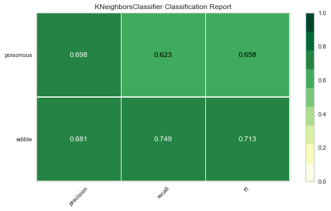

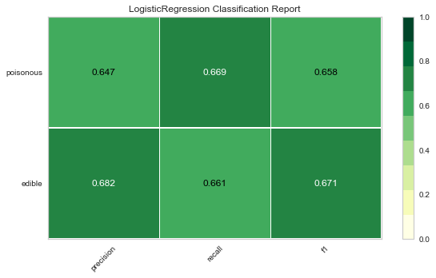

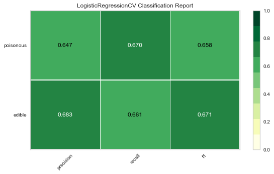

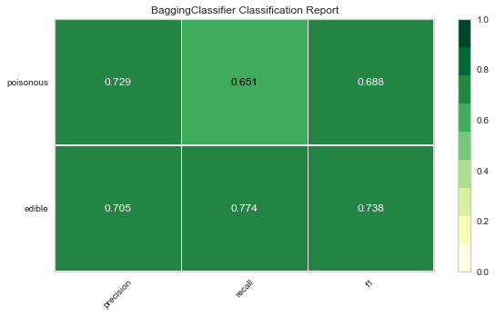


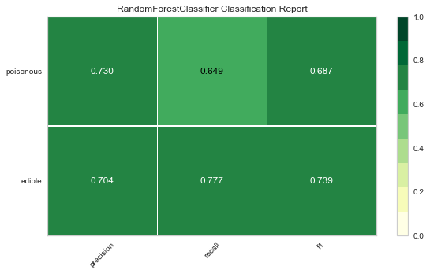


---
# Alternate visualizations:
* <h3>HTML table (with Pandas Style)</h3>
* <h3>Bar plot</h3>
---

## Table output with class & support in column headers:
### &rarr; using `model_evaluation_report_tbl(models, X, y, labels, caption)`:

```python
rpts.model_evaluation_report_tbl(models, X, y, labels, 'Model selection report')  # green: max; pink: min
```
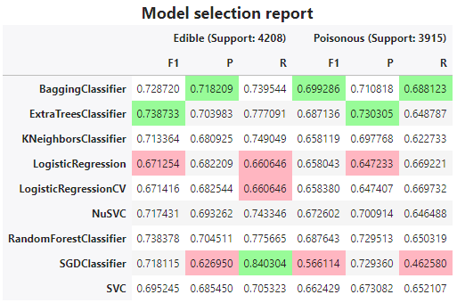


## Bar plot output 
### &rarr; using `model_evaluation_report_bar(models, X, y, labels)`:

```python
rpts.model_evaluation_report_bar(models, X, y, labels, xlim_to_1=False, encode=True)
# Note: xlim_to_1=False, encode=True :: default values
```

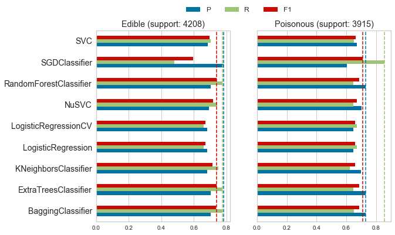


### same with x-limit set to 1:


```python
rpts.model_evaluation_report_bar(models, X, y, labels, xlim_to_1=True)
```
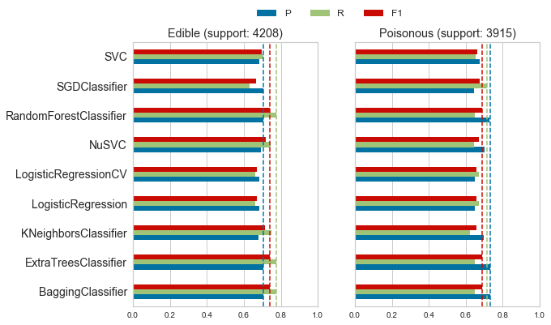


## Example with a multi-class classification

```python
# Iris dataset from sklearn & same models:
X, y, labels = rpts.get_iris_data()
models = rpts.get_models()
```

```python
# The encoding is alredy done on this dataset, so encode=False.
rpts.model_evaluation_report_bar(models, X, y, labels, encode=False)
```
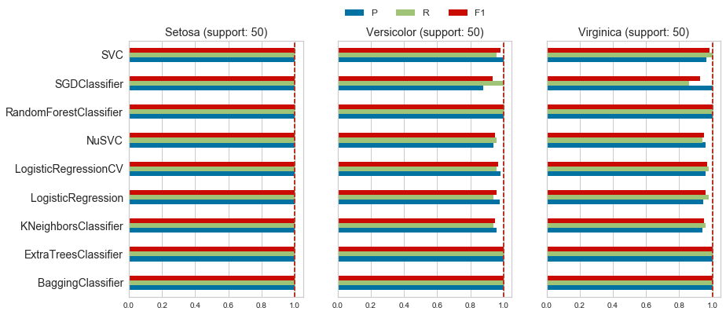


## Clearly, the model scores depend on the model **and** the dataset.

---
# Using radar plots: one plot for each class.

*I've attempted reproducing the radar plots in a single row (whenever possible), but that implementation needs more work as the plots end up being squished too close together.*

I'm glad I went through adapting DeepMind/bsuite radar charts, but I am I not quite satisfied with the outcome, at least with the Iris dataset: they only make it easy to id the least performant model, here SGDClassifier.  
Additionally, until &mdash; and if &mdash; I find a way to line up the plots more compactly, they also suffer from the same 'scrolling objection' I initially made...with only 3 classes!

```python
dfm_iris = rpts.get_scores_df(models, X, y, labels, encode=False)

for lbl in labels:
    rpts.scores_radar_plot_example(dfm_iris, cat=lbl)
```

I'm glad I went through adapting DeepMind/bsuite radar charts, but I am I not quite satisfied with the outcome, at least with the Iris dataset: they only make it easy to id the least performant model, here SGDClassifier.  
Additionally, until I find a way to line up the plots more compactly, they also suffer from the same 'scrolling objection' I initially made...with only 3 classes!

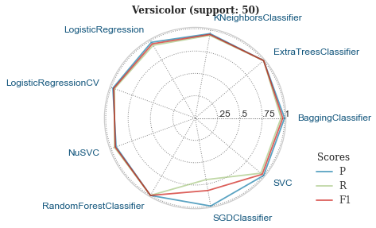

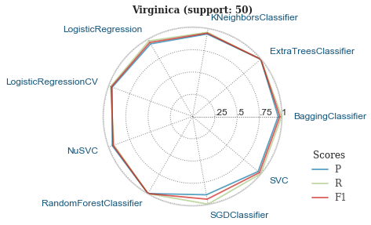

---
---
# Implementation notes: `get_scores_df()`

This function has a parameter, `to_style`, that acts as a swicth to output a DataFrame with different column MutliIndex.  
Only the reporting function using the Pandas Styler, `model_evaluation_report_tbl()`, requires `to_style=True`, while the others do not (default = False).


```python
dfm_iris_tbl = rpts.get_scores_df(models, X, y, labels, encode=False, to_style=True)
dfm_iris_tbl.head()
```
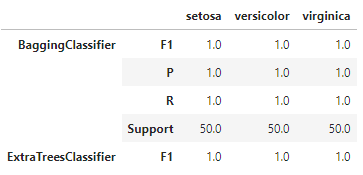

```python
dfm_iris = rpts.get_scores_df(models, X, y, labels, encode=False)
dfm_iris.head()
```
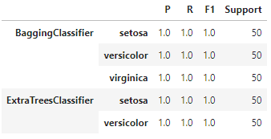
